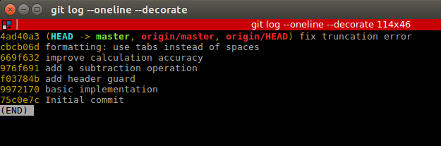
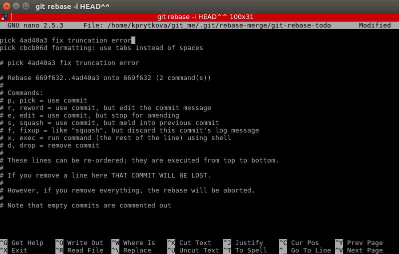
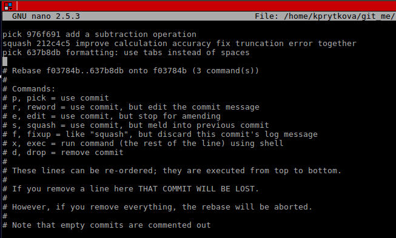
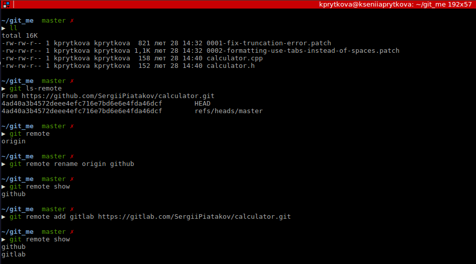

# calculator (nothing about counting, but 100% about GIT)
the best thing is [**Pro Git book**](https://git-scm.com/book/en/v2), also [**How to Write a Git Commit Message**](https://chris.beams.io/posts/git-commit/)

but ..

The task is:

> Clone the following repo: https://github.com/SergiiPiatakov/calculator.git.
> 1. Using `rebase -i` swap the following commits: "fix truncation error" and "formatting: use tabs instead of spaces".
> 2. Then sign them and create two patches using `git format-patch`.
> 3. Then combine "improve calculation accuracy" and "fix truncation error" into one patch using `rebase -i`. Sign it.
> 4. Then remove the top patch "formatting: use tabs instead of spaces" using `git rebase -i` - I really don't like tabs;).
> 5. Rename the current remote on the "github".
> 6. Add another remote: https://gitlab.com/SergiiPiatakov/calculator.git and call it "gitlab".
> 7. Get code from the "gitlab" remote by `git fetch`, and explore it by `git log gitlab/master`.
> 8. Then grab the commit: "add a multiplication operation" by `git cherry-pick`.
> 9. Create your own patch about 5-15 lines (any changes).
> Push the result into your own repo.

let's be ready first:
```
$ git clone  https://github.com/SergiiPiatakov/calculator.git git_me
$ cd git_me
```
what's inside?
```
$ tree .
```
view all existing commits
```
$ git log
```
you'll see:



or we can use smth like `$ git log --oneline --decorate`, whatever.

## swap commits
From the list of commits you can see that we need to swap the last 2 commits, so:
```
$ git rebase -i HEAD^^
```
(or `git rebase -i <hash>`)



and git will say:

  > * error: could not apply 4ad40a3... fix truncation error
  > * When you have resolved this problem, run "git rebase --continue".
  > * If you prefer to skip this patch, run "git rebase --skip" instead.
  > * To check out the original branch and stop rebasing, run "git rebase --abort".
  > * Could not apply 4ad40a3b4572deee4efc716e7bd6e6e4fda46dcf... fix truncation error

it's about git conflict, resolve it (we can use merge tools, for ex. `meld`):
```
$ git config --local merge.tool meld
$ git mergetool
```
or by hands, up on you. After conflict has been resolved:
```
$ git add calculator.cpp
$ git rebase --continue
```
**Successfully rebased and updated refs/heads/master? No? `git rebase --abort` && try again.**

> * 19db02e (HEAD -> master) formatting: use tabs instead of spaces
> * 97c1543 fix truncation error
> * 669f632 improve calculation accuracy
> * 976f691 add a subtraction operation
> * f03784b add header guard
> * 9972170 basic implementation
> * 75c0e7c Initial commit

## sign commits
```
$ git show -n2
$ git rebase -i HEAD^^ 
```
use `edit` command instead of default `edit`:


next action will be performed twice, because we have 2 commits to change:
```
$ git commit --amend -v -s
$ git rebase --continue
```
run `$ git log` and u will see, that last two commits are signed by u.

## create two patches
```
$ git format-patch HEAD -2
```
(`$ git format-patch par1 par2` par1 - commit (hash) FROM starting from which u want to make you patches; par2 - how much patches you want)

## combine 2 commits into one patch
```
$ git rebase -i HEAD^^^
```
use `squash` command:



sign your new commit and continue:
```
$ git commit -s --amend
$ git rebase --continue
```
## rename the current remote && add another remote


## get code from the remote

```
$ git fetch gitlab
$ git log gitlab/master
$ git branch -av
```
## grab the commit
`$ git log gitlab/master` to figure out hash of the commit.
```
$ git log --oneline gitlab/master
$ git cherry-pick e0ea21b
```
> * error: could not apply e0ea21b... add a multiplication operation
> * hint: after resolving the conflicts, mark the corrected paths
> * hint: with 'git add <paths>' or 'git rm <paths>' 
> * hint: and commit the result with 'git commit'
  
we need to fix git conflict (`$ git status` and `$ vim <file_with_conflict>`) and then:
```
$ git cherry-pick --continue
```
## push the result into your own repo
create repo first, then:
```
$ git remote add my_github https://github.com/KseniiaPrytkova/calculator.git
$ git push my_github
```
